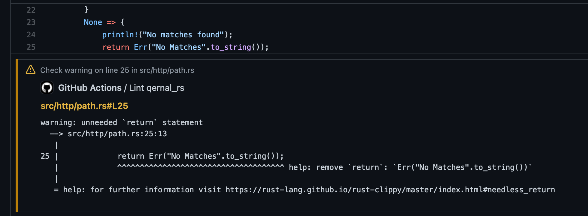

# Github Actions: Rust Clippy


Github action to run clippy against a repository, this providers linting with the following features;

- Globbing for repositories that have multiple rust projects in them
- SSH key for projects that use cargo to pull private Git repositories
- Error and Warning outputs that highlight specific lines on PR's and commits
- Specify specific version of Rust to use



## Workflow configuration

To use this action, define it in your workflow;

```yaml
on: [push, pull_request]

jobs:
  lint:
    runs-on: self-hosted
    name: Lint package
    steps:
      - uses: actions/checkout@v2
      - uses: qernal/github-actions-rust-clippy@v1.6.0
```

## Action parameters

| Parameter | Description | Required |
| ---- | ---- | ---- |
| `clippy_args` | Arguments for clippy configuration | N |
| `path_glob` | Glob for path finding (when a repository has multiple rust projects) | N |
| `git_ssh_key` | Base64 encoded SSH key used for cargo when private git repositories are specified | N |
| `github_pat` | GitHub PAT (token) for PAT authentication when private git repositories are specified | N |
| `threads` | Threads to run at once - for concurrency of functions used with `path_glob` (integer) | N |
| `rust_version` | Version of rust to use, e.g. `1.42` otherwise the latest at action compilation will be used | N |

Example;

```yaml
    steps:
      - uses: actions/checkout@v2
      - uses: qernal/github-actions-rust-clippy@v1.4.0
        with:
          args: "--verbose"
          path_glob: "**/src"
          git_ssh_key: "${{ secrets.base64_ssh_key }}" # Must be base64 encoded and a valid RSA key
          rust_version: 1.42
```

## Manual runs

You can use the container without the context of the runner, and just run the container like so;

```bash
docker run --rm -v `pwd`:/github/workspace ghcr.io/qernal/gh-actions/rust-clippy-x86_64:v1.6.0
```

Replace the `pwd` with your workspace if you're not running from the current directory

## Development

### Building Locally

In the root of this repository, the following will buuld the container;

```bash
docker build -t ghcr.io/qernal/gh-actions/rust-clippy-x86_64:v1.6.0 -f ./Dockerfile ./
```

### Running Locally

The GitHub action call can be simulated locally, an example of this is below;

```bash
# Glob example of multiple cargos
docker run --rm -e INPUT_PATH_GLOB=src/functions/*/*/ -e INPUT_THREADS=4 -e INPUT_GIT_SSH_KEY="$(cat ~/.ssh/my_key | base64 -w0)" -v `pwd`:/github/workspace ghcr.io/qernal/gh-actions/rust-clippy-x86_64:v1.6.0

# Specifiying rust version
docker run --rm -e INPUT_RUST_VERSION=1.56 -e INPUT_THREADS=4 -e INPUT_GIT_SSH_KEY="$(cat ~/.ssh/my_key | base64 -w0)" -v `pwd`:/github/workspace ghcr.io/qernal/gh-actions/rust-clippy-x86_64:v1.6.0
```